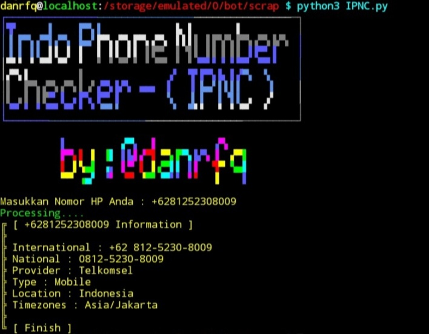

# IPNC
Indo Phone Number Checker (IPNC). Tools for checking your Indonesia phone number information.


## Installation & Run the Program

So easy.

```bash
pkg install python3
pkg install requests
pkg install toilet
pkg install git
git clone https://github.com/danrfq/IPNC
cd IPNC
python3 IPNC.py
```
## Use as package
besides using it with cli you can also use it as a package, look at the example below

```python
from ipnc import Model

mod = Model()
for i in mod.get_info("+6281291718019"):
    print(i)
```
result
```
{
    'number_phone': '+6281351387634', 'international': '+62 813-5138-7634', 'national': '0813-5138-7634', 
    'provider': 'Telkomsel', 
    'type': 'Mobile', 
    'location': 'Indonesia', 
    'timezone': ['Asia/Jakarta']
}
```
## Credit

Thanks to [Widhi](https://github.com/widhisec/phoneinfo) for making an open source project. ;)
